---
## Front matter
lang: ru-RU
title: Презентация по лабораторной работе №1
subtitle: Основы информационной безопасности
author:
  - Федорова А.И
  
## i18n babel
babel-lang: russian
babel-otherlangs: english

## Formatting pdf
toc: false
toc-title: Содержание
slide_level: 2
aspectratio: 169
section-titles: true
theme: metropolis
header-includes:
 - \metroset{progressbar=frametitle,sectionpage=progressbar,numbering=fraction}
 
## Fonts
mainfont: PT Serif
romanfont: PT Serif
sansfont: PT Sans
monofont: PT Mono
mainfontoptions: Ligatures=TeX
romanfontoptions: Ligatures=TeX
sansfontoptions: Ligatures=TeX,Scale=MatchLowercase
monofontoptions: Scale=MatchLowercase,Scale=0.9

---

## Актуальность

Для специалиста важно уметь устанавливать новые дистрибутивы на свое устройство и уметь работать с ними

## Цели и задачи

- установить и настроить новейшую версию дистрибутива Rocky
- cделать задания и найти: 

1. Версия ядра Linux (Linux version).
2. Частота процессора (Detected Mhz processor).
3. Модель процессора (CPU0).
4. Объем доступной оперативной памяти (Memory available).
5. Тип обнаруженного гипервизора (Hypervisor detected).
6. Тип файловой системы корневого раздела.

## Предварительная установка

Выделяю оперативную память и кол-во ядер процессора (рис1.)

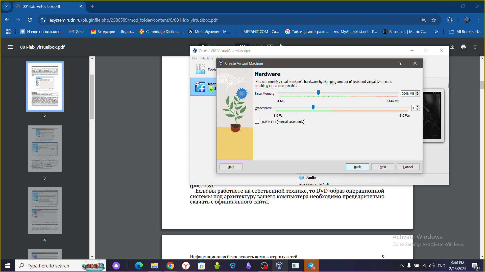{#fig:001 width=70%}

Устанавливаю имя пользователя и пароль (рис.2)

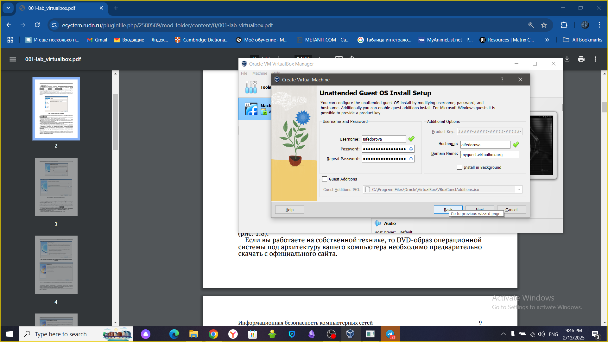{#fig:002 width=70%}

Ждем пока система установится и видим, что была создана еще одна виртуальная машина, но с другой системой.(рис.3)

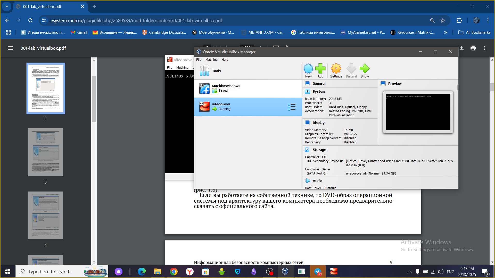{#fig:003 width=70%}

## Настройки

После проведения всех необходимых настроек, ждем, пока все настройки установятся и система загрузится. (рис.4)

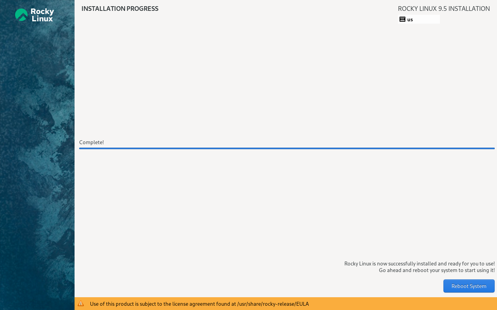{#fig:004 width=70%}

## выполнение задания

Теперь будем выполнять второе задание. 
Открываю терминал, в нем прописываю dmesg | less (рис. 15).

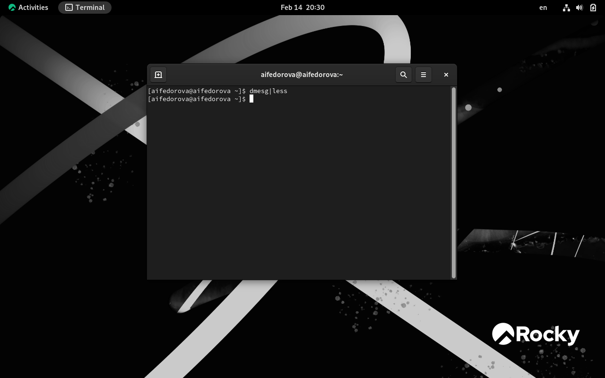{#fig:015 width=70%}

## выполнение задания

Версия ядра 5.14.0-503.14.1.el9_5.x86_64 (рис. 16).

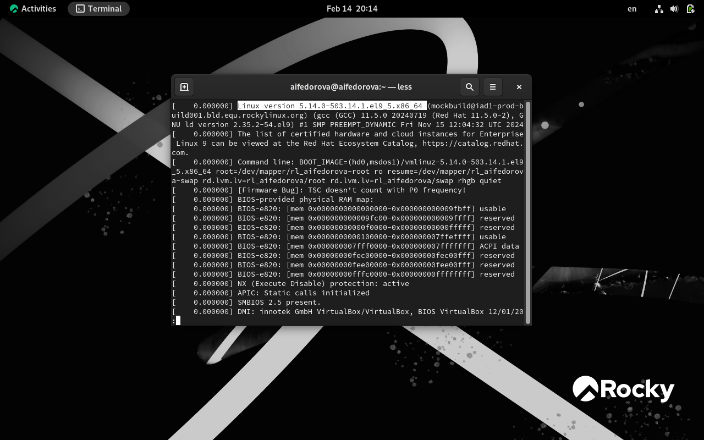{#fig:016 width=70%}

## выполнение задания

Частота процессора 2096.006 МГц (рис. 17).

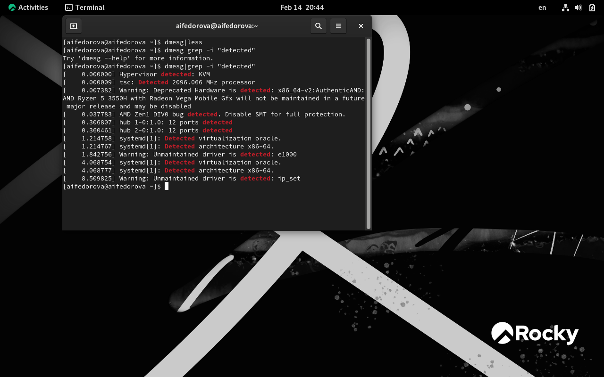{#fig:017 width=70%}

## выполнение задания

Модель процессора AMD Ryzen 355OH (рис. 18).

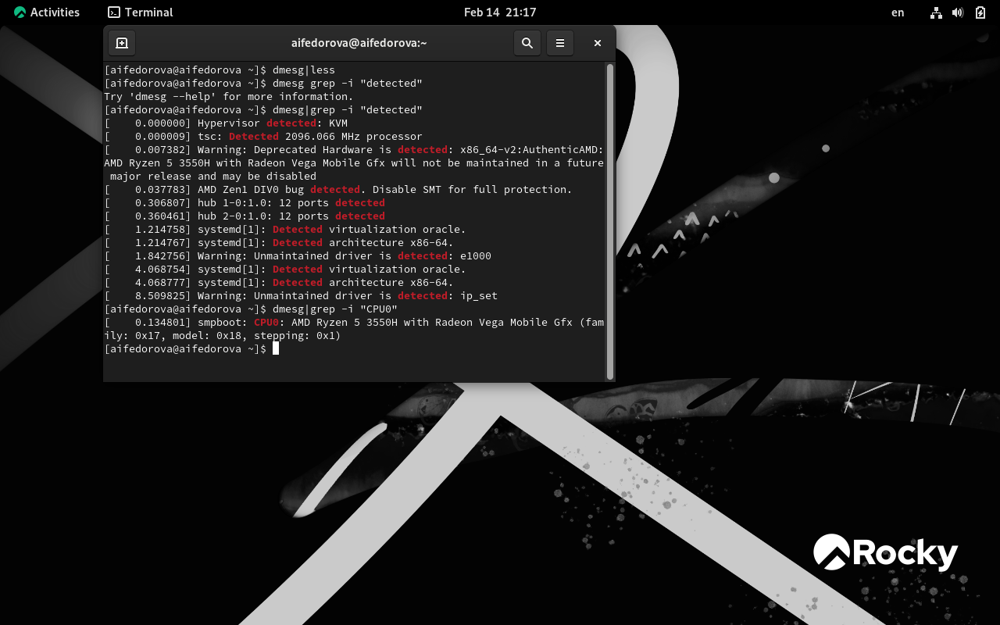{#fig:018 width=70%}

## выполнение задания

Доступно 209660 Кб из 2096696 Кб (рис. 19).

{#fig:019 width=70%}

## выполнение задания

Обнаруженный гипервизор типа KVM (рис. 20).

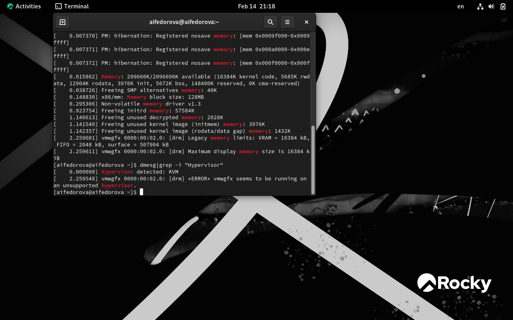{#fig:020 width=70%}

## выполнение задания

sudo fdish -l показывает тип файловой системы, типа Linux, Linux LVM (рис. 21).

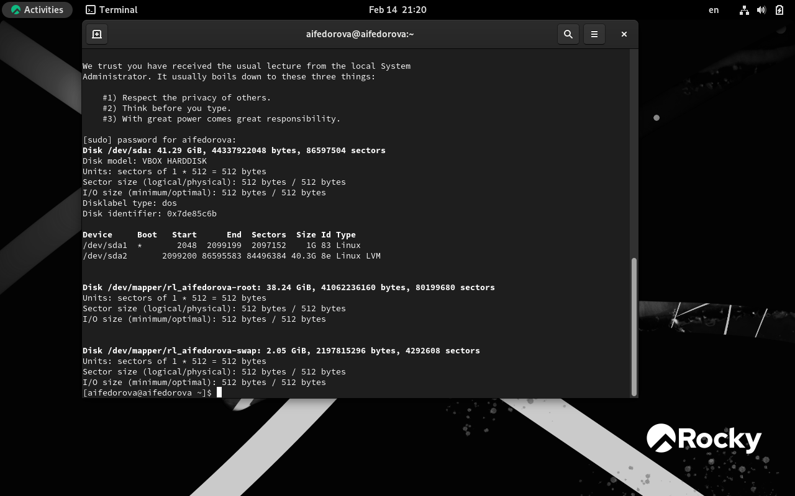{#fig:021 width=70%}

## выполнение задания

Далее показана последовательно монтирования файловых систем (рис. 22).

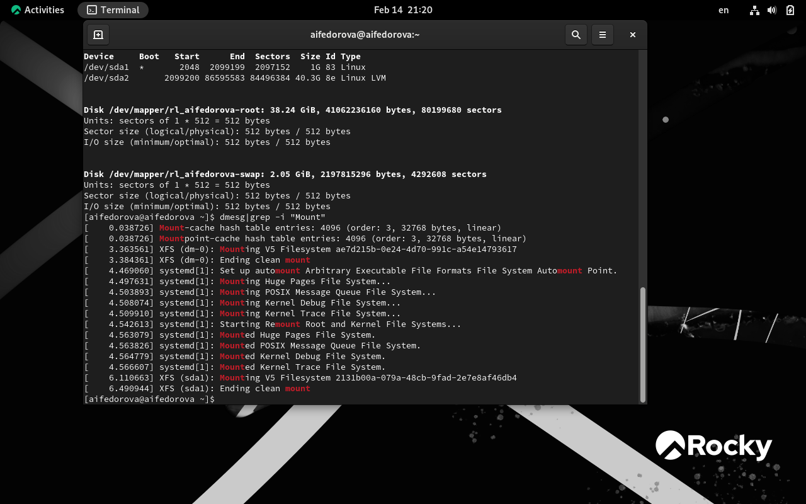{#fig:022 width=70%}

## Результаты

Я переустановила систему и вывела необходимые характеристики своего устройства и текущего дистрибутива.

## Итоговый слайд

Спасибо за внимание!

