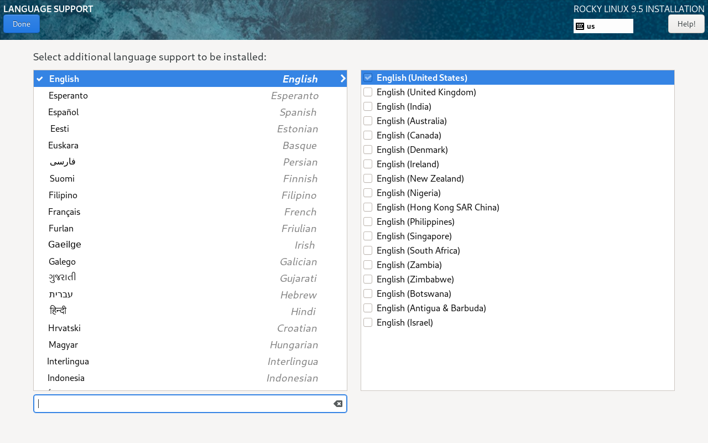

---
## Front matter
title: "Отчёт по лабораторной работе №1"
subtitle: "Основы информационной безопасности"
author: "Федорова Анжелика Игоревна"

## Generic otions
lang: ru-RU
toc-title: "Содержание"

## Bibliography
bibliography: bib/cite.bib
csl: pandoc/csl/gost-r-7-0-5-2008-numeric.csl

## Pdf output format
toc: true # Table of contents
toc-depth: 2
lof: true # List of figures
lot: true # List of tables
fontsize: 12pt
linestretch: 1.5
papersize: a4
documentclass: scrreprt
## I18n polyglossia
polyglossia-lang:
  name: russian
  options:
	- spelling=modern
	- babelshorthands=true
polyglossia-otherlangs:
  name: english
## I18n babel
babel-lang: russian
babel-otherlangs: english
## Fonts
mainfont: IBM Plex Serif
romanfont: IBM Plex Serif
sansfont: IBM Plex Sans
monofont: IBM Plex Mono
mathfont: STIX Two Math
mainfontoptions: Ligatures=Common,Ligatures=TeX,Scale=0.94
romanfontoptions: Ligatures=Common,Ligatures=TeX,Scale=0.94
sansfontoptions: Ligatures=Common,Ligatures=TeX,Scale=MatchLowercase,Scale=0.94
monofontoptions: Scale=MatchLowercase,Scale=0.94,FakeStretch=0.9
mathfontoptions:
## Biblatex
biblatex: true
biblio-style: "gost-numeric"
biblatexoptions:
  - parentracker=true
  - backend=biber
  - hyperref=auto
  - language=auto
  - autolang=other*
  - citestyle=gost-numeric
## Pandoc-crossref LaTeX customization
figureTitle: "Рис."
tableTitle: "Таблица"
listingTitle: "Листинг"
lofTitle: "Список иллюстраций"
lotTitle: "Список таблиц"
lolTitle: "Листинги"
## Misc options
indent: true
header-includes:
  - \usepackage{indentfirst}
  - \usepackage{float} # keep figures where there are in the text
  - \floatplacement{figure}{H} # keep figures where there are in the text
---

# Цель работы

Целью данной работы является приобретение практических навыков
установки операционной системы на виртуальную машину, настройки ми-
нимально необходимых для дальнейшей работы сервисов

# Задание

1. Установка и настройка операционной системы
2. Получить следующую информацию.
   - Версия ядра Linux (Linux version).
   - Частота процессора (Detected Mhz processor).
   - Модель процессора (CPU0).
   - Объем доступной оперативной памяти (Memory available).
   - Тип обнаруженного гипервизора (Hypervisor detected).
   - Тип файловой системы корневого раздела.

# Выполнение лабораторной работы

Скачиваю последнюю версию Rocky на свой компьютер и устанавливаю его как iso image (рис1.)

{#fig:001 width=70%}

Выделяю оперативную память и кол-во ядер процессора (рис2.)

{#fig:002 width=70%}

устанавливаю имя пользователя и пароль (рис.3)

{#fig:003 width=70%}

Выделяю нужное кол-во памяти SSD диска для поддержания дистрибутива (рис.4)

{#fig:004 width=70%}

Ждем пока система установится и видим, что была создана еще одна виртуальная машина, но с другой системой.(рис.5)

{#fig:005 width=70%}

Теперь перед установкой самой ОС проведем настройку. Настроим язык. (рис.6)

{#fig:006 width=70%}

Настроем среду со всеми доп.средствами (рис.7)

{#fig:007 width=70%}

Создадим пароль root (рис.8)

{#fig:008 width=70%}

Cоздадим пользователя (рис.9)

{#fig:009 width=70%}

Отключим Kdump (рис.10)

{#fig:010 width=70%}

Подтвердим выделение 40 гб на диске (рис.11)

{#fig:011 width=70%}

Изменим имя хоста (рис.12)

{#fig:012 width=70%}

Теперь ждем, пока все настройки установятся и система загрузится. (рис.13)

{#fig:013 width=70%}

Видим, что система была успешно установлена (рис.14)

{#fig:014 width=70%}

Теперь будем выполнять второе задание. 
Открываю терминал, в нем прописываю dmesg | less (рис. 15).

{#fig:015 width=70%}

Версия ядра 5.14.0-503.14.1.el9_5.x86_64 (рис. 16).

{#fig:016 width=70%}

Частота процессора 2096.006 МГц (рис. 17).

{#fig:017 width=70%}

Модель процессора AMD Ryzen 355OH (рис. 18).

{#fig:018 width=70%}

Доступно 209660 Кб из 2096696 Кб (рис. 19).

{#fig:019 width=70%}

Обнаруженный гипервизор типа KVM (рис. 20).

{#fig:020 width=70%}

sudo fdish -l показывает тип файловой системы, типа Linux, Linux LVM (рис. 21).

{#fig:021 width=70%}

Далее показана последовательно монтирования файловых систем (рис. 22).

{#fig:022 width=70%}

# Ответы на контрольные вопросы

1. Учетная запись содержит необходимые для идентификации пользователя при подключении к системе данные, а так же информацию для авторизации и учета: системного имени (user name) (оно может содержать только латинские буквы и знак нижнее подчеркивание, еще оно должно быть уникальным), идентификатор пользователя (UID) (уникальный идентификатор пользователя в системе, целое положительное число), идентификатор группы (CID) (группа, к к-рой относится пользователь. Она, как минимум, одна, по умолчанию - одна), полное имя (full name) (Могут быть ФИО), домашний каталог (home directory) (каталог, в к-рый попадает пользователь после входа в систему и в к-ром хранятся его данные), начальная оболочка (login shell) (командная оболочка, к-рая запускается при входе в систему).

 2. Для получения справки по команде: <команда> —help; для перемещения по файловой системе - cd; для просмотра содержимого каталога - ls; для определения объёма каталога - du <имя каталога>; для создания / удаления каталогов - mkdir/rmdir; для создания / удаления файлов - touch/rm; для задания определённых прав на файл / каталог - chmod; для просмотра истории команд - history

3. Файловая система - это порядок, определяющий способ организации и хранения и именования данных на различных носителях информации. Примеры: FAT32 представляет собой пространство, разделенное на три части: олна область для служебных структур, форма указателей в виде таблиц и зона для хранения самих файлов. ext3/ext4 - журналируемая файловая система, используемая в основном в ОС с ядром Linux.

4. С помощью команды df, введя ее в терминале. Это утилита, которая показывает список всех файловых систем по именам устройств, сообщает их размер и данные о памяти. Также посмотреть подмонтированные файловые системы можно с помощью утилиты mount.

5. Чтобы удалить зависший процесс, вначале мы должны узнать, какой у него id: используем команду ps. Далее в терминале вводим команду kill < id процесса >. Или можно использовать утилиту killall, что "убьет" все процессы, которые есть в данный момент, для этого не нужно знать id процесса.

# Выводы

Я приобрела практические навыки установки операционной системы на виртуальную машину, настройки ми- нимально необходимых для дальнейшей работы сервисов.

# Список литературы

[Лабораторная работа №1](https://esystem.rudn.ru/pluginfile.php/2580589/mod_folder/content/0/001-lab_virtualbox.pdf)

