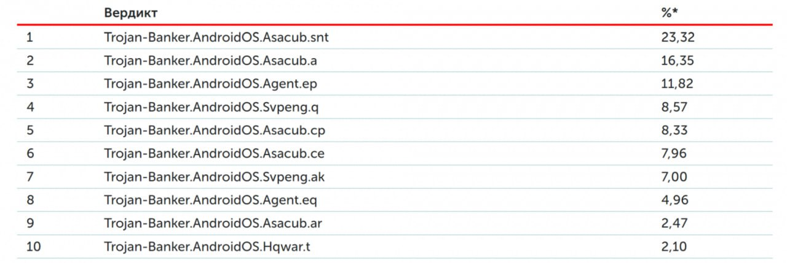
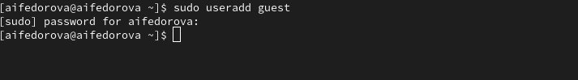
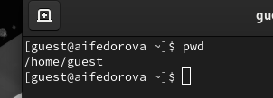
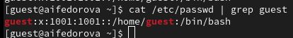
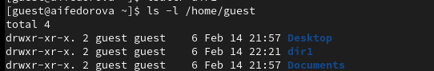
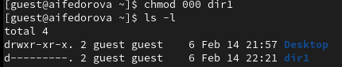
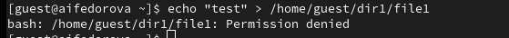

---
## Front matter
lang: ru-RU
title: Презентация по лабораторной работе №2
subtitle: Основы информационной безопасности
author:
  - Федорова А.И

## i18n babel
babel-lang: russian
babel-otherlangs: english

## Formatting pdf
toc: false
toc-title: Содержание
slide_level: 2
aspectratio: 169
section-titles: true
theme: metropolis
header-includes:
 - \metroset{progressbar=frametitle,sectionpage=progressbar,numbering=fraction}
 
## Fonts
mainfont: PT Serif
romanfont: PT Serif
sansfont: PT Sans
monofont: PT Mono
mainfontoptions: Ligatures=TeX
romanfontoptions: Ligatures=TeX
sansfontoptions: Ligatures=TeX,Scale=MatchLowercase
monofontoptions: Scale=MatchLowercase,Scale=0.9
---


## Цели и задачи

Получение практических навыков работы в консоли с атрибутами фай-
лов, закрепление теоретических основ дискреционного разграничения до-
ступа в современных системах с открытым кодом на базе ОС Linux1.


## Создание нового пользователя

Добавляю нового пользователя с помощью следующей команды (рис.1).

{#fig:001 width=70%}

## Создание нового пользователя

Задаю пароль для учетной записи (рис.2)

{#fig:002 width=70%}

## Создание нового пользователя

Меняю пользователя в системе на guest (рис.3)

{#fig:003 width=70%}

## Создание нового пользователя

Определяю с помощью команды pwd?, что я нахожусь в домашней директории. (рис.4)

{#fig:004 width=70%}

## Информация о новом пользователе

Получаю информацию о пользователе с помощью команды 
```
cat /etc/passwd | grep guest

```
## Информация о новом пользователе

В выводе получаю коды пользователя и группы, адрес домашней директории (рис. 8).

{#fig:008 width=70%}

## Cоздание новой директории

Создаю поддиректорию dir1 для домашней директории. Расширенные атрибуты командой lsattr просмотреть у директории не удается, но атрибуты есть: drwxr-xr-x, их удалось просмотреть с помощью команды ls -l (рис. 11).

{#fig:011 width=70%}

## Cоздание новой директории

Cнимаю атрибуты командой chmod 000 dir1, при проверке с помощью команды ls -l видно, что теперь атрибуты действительно сняты (рис. 12).
 
{#fig:012 width=70%}

## Cоздание нового файла

Попытка создать файл в директории dir1. Выдает ошибку: "Отказано в доступе" (рис. 13). 

{#fig:013 width=70%}


## Результаты

Были получены практические навыки работы в консоли с атрибутами файлов, закреплены теоретические основы дискреционного разграничения доступа в современных системах с открытым кодом на базе ОС Linux.

## Итоговый слайд

Спасибо за внимание!


