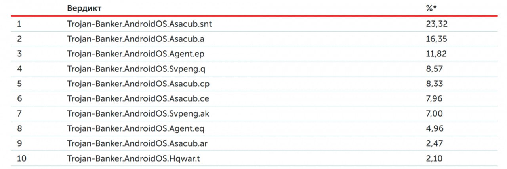

---
## Front matter
title: "Вредоносные программы. Троянские программы"
subtitle: "Основы информационной безопасности"
author: "Федорова Анжелика Игоревна"

## Generic otions
lang: ru-RU
toc-title: "Содержание"

## Bibliography
bibliography: bib/cite.bib
csl: pandoc/csl/gost-r-7-0-5-2008-numeric.csl

## Pdf output format
toc: true # Table of contents
toc-depth: 2
lof: true # List of figures
lot: true # List of tables
fontsize: 12pt
linestretch: 1.5
papersize: a4
documentclass: scrreprt
## I18n polyglossia
polyglossia-lang:
  name: russian
  options:
	- spelling=modern
	- babelshorthands=true
polyglossia-otherlangs:
  name: english
## I18n babel
babel-lang: russian
babel-otherlangs: english
## Fonts
mainfont: IBM Plex Serif
romanfont: IBM Plex Serif
sansfont: IBM Plex Sans
monofont: IBM Plex Mono
mathfont: STIX Two Math
mainfontoptions: Ligatures=Common,Ligatures=TeX,Scale=0.94
romanfontoptions: Ligatures=Common,Ligatures=TeX,Scale=0.94
sansfontoptions: Ligatures=Common,Ligatures=TeX,Scale=MatchLowercase,Scale=0.94
monofontoptions: Scale=MatchLowercase,Scale=0.94,FakeStretch=0.9
mathfontoptions:
## Biblatex
biblatex: true
biblio-style: "gost-numeric"
biblatexoptions:
  - parentracker=true
  - backend=biber
  - hyperref=auto
  - language=auto
  - autolang=other*
  - citestyle=gost-numeric
## Pandoc-crossref LaTeX customization
figureTitle: "Рис."
tableTitle: "Таблица"
listingTitle: "Листинг"
lofTitle: "Список иллюстраций"
lotTitle: "Список таблиц"
lolTitle: "Листинги"
## Misc options
indent: true
header-includes:
  - \usepackage{indentfirst}
  - \usepackage{float} # keep figures where there are in the text
  - \floatplacement{figure}{H} # keep figures where there are in the text
---

# Введение 

Троян – это вредоносная программа, которая маскируется под легальное ПО. С их помощью злоумышленники пытаются получить доступ к системе пользователя. Используя методы социальной инженерии, злоумышленники обманом уговаривают пользователя загрузить троян на устройство и запустить его. После активации троянские программы начинают шпионить за пользователем, крадут его данные и открывают злоумышленнику потайной вход в систему.

История этого термина уходит в далекое прошлое. Все мы помним древнегреческий миф о троянском коне, во чреве которого греки тайно пробрались в город Трою и разгромили его. В мире компьютерных технологий вирусы трояны действуют похожим образом: они прячутся в безобидных на первый взгляд программах или прибегают к другим уловкам, чтобы пробраться на устройство пользователя. Термин впервые появился в докладе ВВС США в 1974 году, в котором рассматривались потенциальные способы взлома компьютерных систем.
Иногда такие угрозы называются «троянскими вирусными программами», но это не совсем верная формулировка. Трояны распространяются под маской полезного приложения или контента, но на деле несут вредоносную нагрузку. Лучше всего рассматривать троянские программы как способ доставки вредоносного ПО на устройство жертвы.

{#fig:001 width=70%}

Чем отличается троян от вируса? 
Вирус — это вредоносный исполняемый код, прикрепленный к другому исполняемому файлу, который может быть безвредным или изменять или удалять данные. Троянский конь — это форма вредоносного ПО, которая захватывает некоторую важную информацию о компьютерной системе или компьютерной сети. Антивирусное программное обеспечение используется для защиты от вирусов.

# Опасность в мире

Каждый месяц продукты «Лаборатории Касперского» блокируют десятки тысяч вредоносных атак на Android-устройства, целью которых является кража денег со счетов пользователей. Относительно общего количества атак это на самом деле немного: в Австралии за первый квартал было атаковано 0,81% всех пользователей, и это самый высокий показатель. В России банковские трояны были заблокированы у 0,64% пользователей. Банковские трояны на десктопах встречаются чаще — детектируются у 1–3% пользователей в зависимости от страны. Как обычно, внимание к таким вредоносным программам обусловлено немедленными и чувствительными финансовыми потерями, в случае успешного заражения. Посмотрим на список самых популярных зловредов для кражи денег на Android:

{#fig:002 width=70%}

Нередки случаи, когда троянами жертвами троянов становятся банки или другие крупные организации.  Например, банковский троян Trickbot начал охоту за данными клиентов крупнейших мировых компаний, включая Google, Microsoft, российский Ситибанк и сервис криптовалютных кошельков Blockchain.com, сообщается в блоге поставщика решений кибербезопасности Check Point. С ноября 2020 года Trickbot заразил более 140 тысяч устройств по всему миру, сообщили в пресс-службе компании.

# Виды троянов

Наиболее распространены следующие виды троянов:

Клавиатурные шпионы (Trojan-SPY) - трояны, постоянно находящиеся в памяти и сохраняющие все данные поступающие от клавиатуры с целью последующей передачи этих данных злоумышленнику. Обычно таким образом злоумышленник пытается узнать пароли или другую конфиденциальную информацию

Похитители паролей (Trojan-PSW) - трояны, также предназначенные для получения паролей, но не использующие слежение за клавиатурой. Обычно в таких троянах реализованы способы извлечения паролей из файлов, в которых эти пароли хранятся различными приложениями

Утилиты удаленного управления (Backdoor) - трояны, обеспечивающие полный удаленный контроль над компьютером пользователя. Существуют легальные утилиты такого же свойства, но они отличаются тем, что сообщают о своем назначении при установке или же снабжены документацией, в которой описаны их функции. Троянские утилиты удаленного управления, напротив, никак не выдают своего реального назначения, так что пользователь и не подозревает о том, что его компьютер подконтролен злоумышленнику. Наиболее популярная утилита удаленного управления - Back Orifice

Анонимные smtp-сервера и прокси (Trojan-Proxy) - трояны, выполняющие функции почтовых серверов или прокси и использующиеся в первом случае для спам-рассылок, а во втором для заметания следов хакерами

Модификаторы настроек браузера (Trojan-Cliker) - трояны, которые меняют стартовую страницу в браузере, страницу поиска или еще какие-либо настройки, для организации несанкционированных обращений к интернет-ресурсам

Инсталляторы прочих вредоносных программ (Trojan-Dropper) - трояны, представляющие возможность злоумышленнику производить скрытую установку других программ

Загрузчики вредоносных программ (Trojan Downloader) - трояны, предназначенные для загрузки на компьютер-жертву новых версий вредоносных программ, или рекламных систем

Уведомители об успешной атаке (Trojan-Notifier) - трояны данного типа предназначены для сообщения своему "хозяину" о зараженном компьютере

"Бомбы" в архивах (ARCBomb) - трояны, представляющие собой архивы, специально оформленные таким образом, чтобы вызывать нештатное поведение архиваторов при попытке разархивировать данные - зависание или существенное замедление работы компьютера, заполнение диска большим количеством "пустых" данных

Логические бомбы - чаще не столько трояны, сколько троянские составляющие червей и вирусов, суть работы которых состоит в том, чтобы при определенных условиях (дата, время суток, действия пользователя, команда извне) произвести определенное действие: например, уничтожение данных

Утилиты дозвона - сравнительно новый тип троянов, представляющий собой утилиты dial-up доступа в интернет через платные почтовые службы. Такие трояны прописываются в системе как утилиты дозвона по умолчанию и влекут за собой крупные счета за пользование интернетом

# Способы защиты от троянов

Существует множество вариантов проникновения программ-вредителей в систему. Вирусы могут попасть в ваш компьютер или телефон в результате открытия вложений, полученных по электронной почте, или перехода по незнакомой ссылке. Незнакомые программы или приложения также могут содержать в себе вредоносное ПО. Конечно, лучше заранее обезопасить себя от троянов, минимизировав работу с сомнительными источниками, чем устранять возникшую проблему.
Как было сказано ранее, трояны отличаются от вирусов, хоть и принято относить их к одному виду вредоносных программ. Вирусы распространяются по системе самостоятельно и не требуют постоянного контроля со стороны разработчика.
Вот несколько рекомендаций, которые помогут вам защитить своё устройство от проникновения троянов вирусов:

1. Не открывайте электронные письма с незнакомых адресов. Если в письме есть вложение, то подумайте, нужно ли вам его открывать. Такие документы и ссылки часто содержат в себе трояны.
2. Регулярно обновляйте программы и приложения, которые установлены на ваших устройствах. Обновления призваны исправить уязвимые места в ПО и минимизировать риск проникновения вируса.
3. Не пользуйтесь макросами в программах Word и Excel.
4. Не переходите по незнакомым и сомнительным ссылкам. Они могут привести вас на поддельный сайт, который установит на ваше устройство вредоносное программное обеспечение в фоновом режиме.
5. Загружайте любые программы только из проверенных источников. Особенно это касается мобильных приложений. Если нужная программа отсутствует в Google Play Store и Apple Store,то следует задуматься о её безопасности.
6. Зайдите в настройки и установите отображение всех расширений файлов. Тогда вы сразу заметите, если какой-либо файл на самом деле является не тем, чем кажется. Например, изображение имеет расширение не jpg, a exe.
7. При посещении сайтов и сервисов, связанных с платёжными системами и владеющих конфиденциальными данными пользователя, используйте двухфакторную аутентификацию. Это позволит обезопасить данные от злоумышленников и запретить доступ к вашему аккаунту даже в том случае, если им удастся завладеть паролем.
8. Время от времени проверяйте систему на наличие вредоносных программ при помощи антивирусного ПО.
9. Производите резервное копирование данных. Это касается как облачных сервисов, так и физических носителей информации.

# Выводы

Таким образом, трояны являются серьезной угрозой безопасности пользователей и крупных предприятий. Поэтому мы должны быть осведолены о них и предпринять необходимые меры защиты и борьбы с ними.

# Источники

[Статья хабра](https://habr.com/ru/companies/kaspersky/articles/453686/)

[Cтатья](https://tass.ru/ekonomika/13806329)

[Cтатья](https://www.eset.com/ua-ru/support/information/entsiklopediya-ugroz/troyan/)
