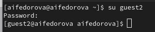
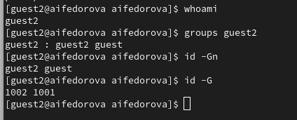
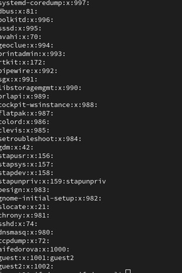

---
## Front matter
lang: ru-RU
title: Презентация по лабораторной работе №3
subtitle: Основы информационной безопасности
author:
  - Федорова А.И

## i18n babel
babel-lang: russian
babel-otherlangs: english

## Formatting pdf
toc: false
toc-title: Содержание
slide_level: 2
aspectratio: 169
section-titles: true
theme: metropolis
header-includes:
 - \metroset{progressbar=frametitle,sectionpage=progressbar,numbering=fraction}
---

## Актуальность

Важно научиться создавать новых пользователей, создавать новые группы с ними и изменять права доступа к файлам

## Цели и задачи

Получение практических навыков работы в консоли с атрибутами фай-
лов для групп пользователей.

## Создание нового пользователя

В предыдущей лабораторной был создан пользователь guest, поэтому я создаю только пользователя guest2 (рис.2).

{#fig:001 width=70%}

Добавляю пользователя guest2 в группу (рис.3)

{#fig:002 width=70%}

## Данные о двух пользователях

Я осуществляю вход с помощью двух пользователей и ввожу команду pwd (рис.4)

{#fig:003 width=70%}

{#fig:004 width=70%}

## Данные о двух пользователях

{#fig:005 width=70%}

## Данные о двух пользователях

Уточняю имя моего пользователя, его группу, кто входит в неё
и к каким группам принадлежит он сам. Сразу для двух. (рис.5)

{#fig:006 width=70%}

## Данные о двух пользователях

{#fig:007 width=70%}

## Данные о двух пользователях

Смотрю данные файла etc/group с помощью cat /etc/group (рис.6)

{#fig:008 width=70%}

На другом пользователе делаем то же самое.

## Изменение прав доступа к файлу.

От имени пользователя guest2 выполняю регистрацию пользователя
guest2 в группе guest командой newgrp guest

{#fig:010 width=70%}

## Изменение прав доступа к файлу.

От имени пользователя guest изменяю права директории /home/guest,
разрешив все действия для пользователей группы:
chmod g+rwx /home/guest

{#fig:011 width=70%}

## Результаты

Были получены практические навыки работы в консоли с атрибутами файлов для групп пользователей

## Итоговый слайд

Спасибо за внимание!

