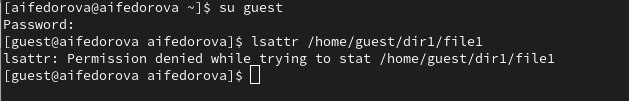
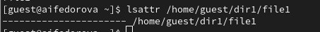
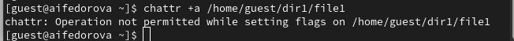
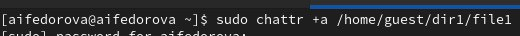
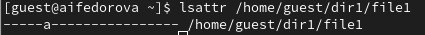
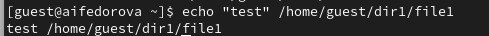
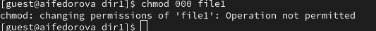

---
## Front matter
lang: ru-RU
title: Презентация поо лабораторной работе №4
subtitle: Основы инофрмационной безопасности
author:
  - Федорова А.И

## i18n babel
babel-lang: russian
babel-otherlangs: english

## Formatting pdf
toc: false
toc-title: Содержание
slide_level: 2
aspectratio: 169
section-titles: true
theme: metropolis
header-includes:
 - \metroset{progressbar=frametitle,sectionpage=progressbar,numbering=fraction}
 
## Fonts
mainfont: PT Serif
romanfont: PT Serif
sansfont: PT Sans
monofont: PT Mono
mainfontoptions: Ligatures=TeX
romanfontoptions: Ligatures=TeX
sansfontoptions: Ligatures=TeX,Scale=MatchLowercase
monofontoptions: Scale=MatchLowercase,Scale=0.9
---

## Актуальность

Нужно научиться менять атрибуты файлов и менять доступ к файлам и объектам

## Цели и задачи

Получение практических навыков работы в консоли с расширенными
атрибутами файлов.

## Содержание исследования

Захожу в пользователя guest(рис. 1).

{#fig:001 width=70%}

## Проверка атрибутов и установка прав

Проверяю атрибуты файла file1 с помощью команды lsattr (рис. 2)

{#fig:002 width=70%}

## Проверка атрибутов и установка прав

Устанавливаю особые права на файл file1 

{#fig:003 width=70%}

## Проверка атрибутов и установка прав

Установливаю на файл /home/guest/dir1/file1 расширен-
ный атрибут a от имени пользователя guest

{#fig:004 width=70%}

## Проверка атрибутов и установка прав

Захожу на вторую консоль с правами администратора либо повысьте
свои права с помощью команды su. Попробую установить расширен-
ный атрибут a на файл /home/guest/dir1/file1 от имени суперполь-
зователя

{#fig:005 width=70%}

## Проверка атрибутов и установка прав

От пользователя guest проверяю правильность установления атрибута

{#fig:006 width=70%}

## Проверка атрибутов и установка прав

Выполняю дозапись в файл file1 слова «test»

{#fig:007 width=70%}

После этого выполняю чтение файла file1 

## Проверка атрибутов и установка прав

Устанавливаю на файл file1 права, запрещающие чтение и запись для владельца файла

{#fig:008 width=70%}

## Результаты

Я изменила аттрибуты и содержимое файла file1, а также сумела манипулироваь правами доступа.

## Итоговый слайд

Спасибо за внимание

