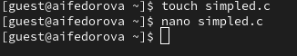
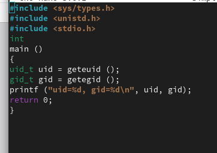
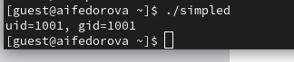
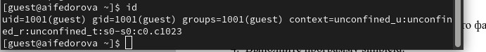
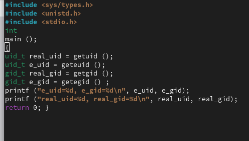
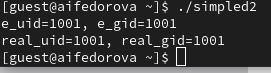

---
## Front matter
title: "Отчет по лабораторной работе №5"
subtitle: "Основы информационной безопасности"

## Generic otions
lang: ru-RU
toc-title: "Содержание"

## Bibliography
bibliography: bib/cite.bib
csl: pandoc/csl/gost-r-7-0-5-2008-numeric.csl

## Pdf output format
toc: true # Table of contents
toc-depth: 2
lof: true # List of figures
lot: true # List of tables
fontsize: 12pt
linestretch: 1.5
papersize: a4
documentclass: scrreprt
## I18n polyglossia
polyglossia-lang:
  name: russian
  options:
	- spelling=modern
	- babelshorthands=true
polyglossia-otherlangs:
  name: english
## I18n babel
babel-lang: russian
babel-otherlangs: english
## Fonts
mainfont: IBM Plex Serif
romanfont: IBM Plex Serif
sansfont: IBM Plex Sans
monofont: IBM Plex Mono
mathfont: STIX Two Math
mainfontoptions: Ligatures=Common,Ligatures=TeX,Scale=0.94
romanfontoptions: Ligatures=Common,Ligatures=TeX,Scale=0.94
sansfontoptions: Ligatures=Common,Ligatures=TeX,Scale=MatchLowercase,Scale=0.94
monofontoptions: Scale=MatchLowercase,Scale=0.94,FakeStretch=0.9
mathfontoptions:
## Biblatex
biblatex: true
biblio-style: "gost-numeric"
biblatexoptions:
  - parentracker=true
  - backend=biber
  - hyperref=auto
  - language=auto
  - autolang=other*
  - citestyle=gost-numeric
## Pandoc-crossref LaTeX customization
figureTitle: "Рис."
tableTitle: "Таблица"
listingTitle: "Листинг"
lofTitle: "Список иллюстраций"
lotTitle: "Список таблиц"
lolTitle: "Листинги"
## Misc options
indent: true
header-includes:
  - \usepackage{indentfirst}
  - \usepackage{float} # keep figures where there are in the text
  - \floatplacement{figure}{H} # keep figures where there are in the text
---

# Цель работы

Изучение механизмов изменения идентификаторов, применения
SetUID- и Sticky-битов. Получение практических навыков работы в кон-
соли с дополнительными атрибутами. Рассмотрение работы механизма
смены идентификатора процессов пользователей, а также влияние бита
Sticky на запись и удаление файлов.


# Выполнение лабораторной работы

Для лабораторной работы необходимо проверить, установлен ли компилятор gcc, комнда `gcc -v` позволяет это сделать. Также осуществляется отключение системы запретом с помощью `setenforce 0` (рис. 1).

{#fig:001 width=70%}

Осуществляется вход от имени пользователя guest (рис. 2).

{#fig:002 width=70%}

Создание файла simpled.c и запись в файл кода (рис. 3)

{#fig:003 width=70%}

```C++ Листинг 1
#include <sys/types.h>
#include <unistd.h>
#include <stdio.h>
int
main ()
{
uid_t uid = geteuid ();
gid_t gid = getegid ();
printf ("uid=%d, gid=%d\n", uid, gid);
return 0;
}
```

Cодержимое файла выглядит следующти образом (рис. 4)

{#fig:004 width=70%}

Компилирую файл, проверяю, что он скомпилировался (рис. 5)

{#fig:005 width=70%}

Запускаю исполняемый файл. В выводе файла выписыны номера пользоватея и групп, от вывода при вводе if, они отличаются только тем, что информации меньше (рис. 6)

{#fig:006 width=70%}

Создание, запись в файл и компиляция файла simpled2.c. Запуск программы (рис. 7)

{#fig:007 width=70%}


{#fig:008 width=70%}

С помощью chown изменяю владельца файла на суперпользователя, с помощью chmod изменяю права доступа (рис. 9)

{#fig:009 width=70%}

Сравнение вывода программы и команды id, наша команда снова вывела только ограниченное количество информации(рис. 10)

Создание и компиляция файла readfile.c (рис. 11)


(рис. 12)


Снова от имени суперпользователи меняю владельца файла readfile. Далее меняю права доступа так, чтобы пользователь guest не смог прочесть содержимое файла (рис. 13)

Проверка прочесть файл от имени пользователя guest.Прочесть файл не удается (рис. 14)

Попытка прочесть тот же файл с помощью программы readfile, в ответ получаем "отказано в доступе" (рис. 15)

Попытка прочесть файл `\etc\shadow` с помощью программы, все еще получаем отказ в доступе (рис. 16)

Пробуем прочесть эти же файлы от имени суперпользователя и чтение файлов проходит успешно (рис. 17)

Проверяем папку tmp на наличие атрибута Sticky, т.к. в выводе есть буква t, то атрибут установлен (рис. 18)

От имени пользователя guest создаю файл с текстом, добавляю права на чтение и запись для других пользователей (рис. 19)

Вхожу в систему от имени пользователя guest2, от его имени могу прочитать файл file01.txt, но перезаписать информацию в нем не могу (рис. 20)

Также невозможно добавить в файл file01.txt новую информацию от имени пользователя guest2 (рис. 21)

Далее пробуем удалить файл, снова получаем отказ (рис. 22)

От имени суперпользователя снимаем с директории атрибут Sticky (рис. 23)

Проверяем, что атрибут действительно снят (рис. 24)

Далее был выполнен повтор предыдущих действий. По результатам без Sticky-бита запись в файл и дозапись в файл осталась невозможной, зато удаление файла прошло успешно (рис. 25)

Возвращение директории tmp атрибута t от имени суперпользователя (рис. 26)

# Выводы

Изучила механизм изменения идентификаторов, применила
SetUID- и Sticky-биты. Получила практические навыки работы в кон-
соли с дополнительными атрибутами. Рассмотрела работы механизма
смены идентификатора процессов пользователей, а также влияние бита
Sticky на запись и удаление файлов.
