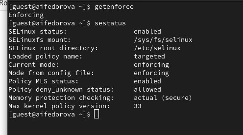
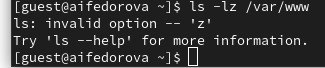

---
## Front matter
lang: ru-RU
title: Презентация по лабораторной работе №6
subtitle: Основы информационной безопасности
author:
  - Федорова А.И


## i18n babel
babel-lang: russian
babel-otherlangs: english

## Formatting pdf
toc: false
toc-title: Содержание
slide_level: 2
aspectratio: 169
section-titles: true
theme: metropolis
header-includes:
 - \metroset{progressbar=frametitle,sectionpage=progressbar,numbering=fraction}
 
## Fonts
mainfont: PT Serif
romanfont: PT Serif
sansfont: PT Sans
monofont: PT Mono
mainfontoptions: Ligatures=TeX
romanfontoptions: Ligatures=TeX
sansfontoptions: Ligatures=TeX,Scale=MatchLowercase
monofontoptions: Scale=MatchLowercase,Scale=0.9
---

## Цели и задачи

Развить навыки администрирования ОС Linux. Получить первое практическое знакомство с технологией SELinux1. Проверить работу SELinx на практике совместно с веб-сервером
Apache. 

## Содержание исследования

Вошла в систему под своей учетной записью. Убедилась, что SELinux работает в режиме enforcing политики targeted с помощью команд getenforce и sestatus

{#fig:001 width=70%}

## Содержание исследования

Запускаю сервер apache, далее обращаюсь с помощью браузера к веб-серверу, запущенному на компьютере, он работает, что видно из вывода команды `service httpd status` 

## Содержание исследования

{#fig:002 width=70%}

С помощью команды `ps auxZ | grep httpd` нашла веб-сервер Apache в списке процессов. Его контекст
безопасности - httpd_t

## Содержание исследования

{#fig:003 width=70%}

## Содержание исследования

Просмотрела текущее состояние переключателей SELinux для Apache с помощью команды `sestatus -bigrep httpd` 

{#fig:004 width=70%}

## Содержание исследования

Просмотрела статистику по политике с помощью команды `seinfo`. Множество пользователей - 8, ролей - 39, типов - 5135. 

{#fig:005 width=70%}

## Содержание исследования

Типы поддиректорий, находящихся в директории `/var/www`, с помощью команды `ls -lZ /var/www` следующие: владелец - root, права на изменения только у владельца. Файлов в директории нет 

{#fig:006 width=70%}

## Содержание исследования

В директории `/var/www/html` нет файлов. 
{#fig:007 width=70%}

## Содержание исследования


Создать файл может только суперпользователь, поэтому от его имени создаем файл touch.html cо следующим содержанием:
```html
<html>
<body>test</body>
</html>
```

{#fig:008 width=70%}


## Результаты

В ходе выполнения данной лабораторной работы были развиты навыки администрирования ОС Linux, получено первое практическое знакомство с технологией SELinux и проверена работа SELinux на практике совместно с веб-сервером
Apache.

## Итоговый слайд

Спасибо за внимание!

