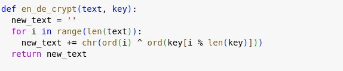
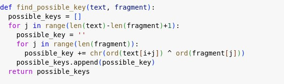
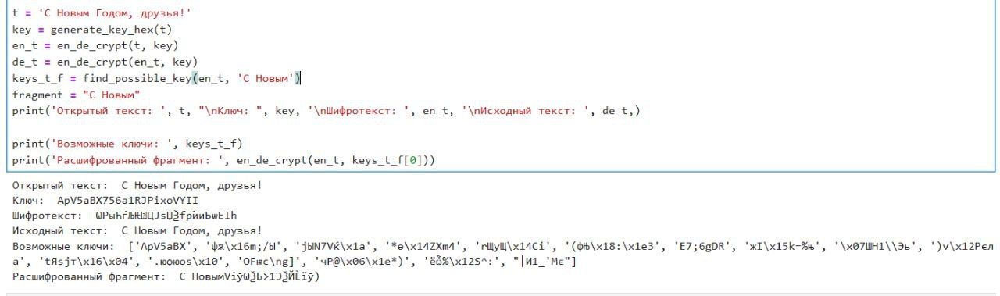

---
## Front matter
lang: ru-RU
title: Презентация по лабораторной работе №7
subtitle: Основы информационной безопасности
author:
  - Федорова А.И


## i18n babel
babel-lang: russian
babel-otherlangs: english

## Formatting pdf
toc: false
toc-title: Содержание
slide_level: 2
aspectratio: 169
section-titles: true
theme: metropolis
header-includes:
 - \metroset{progressbar=frametitle,sectionpage=progressbar,numbering=fraction}
 
## Fonts
mainfont: PT Serif
romanfont: PT Serif
sansfont: PT Sans
monofont: PT Mono
mainfontoptions: Ligatures=TeX
romanfontoptions: Ligatures=TeX
sansfontoptions: Ligatures=TeX,Scale=MatchLowercase
monofontoptions: Scale=MatchLowercase,Scale=0.9

---


## Актуальность

Нужно знать как создавать функции для генераций пароля.

## Цели и задачи

Освоить на практике применение режима однократного гаммирования


## Содержание исследования

Я выполнала лабораторную работа на языке программирования Python, листинг программы и результаты выполнения приведены в отчете.Требуется разработать программу, позволяющее шифровать и дешифровать данные в режиме однократного гаммирования. Начнем с создания функции для генерации случайного ключа 

{#fig:001 width=70%}

## Содержание исследования

Необходимо определить вид шифротекста при известном ключе и известном открытом тексте. Так как операция исключающего или отменяет сама себя, делаю одну функцю и для шифрования и для дешифрования текста 

{#fig:002 width=70%}

## Содержание исследования

Нужно определить ключ, с помощью которого шифротекст может быть преобразован в некоторый фрагмент текста, представляющий собой один из возможных вариантов прочтения открытого текста. Для этого создаю функцию для нахождения возможных ключей для фрагмента текста 

{#fig:003 width=70%}


## Содержание исследования

Листинг программы 1:

```python

import random
import string

def generate_key_hex(text):
    key = ''
    for i in range(len(text)):
        key += random.choice(string.ascii_letters + string.digits) #генерация цифры для каждого символа в тексте
    return key

def en_de_crypt(text, key):
    new_text = ''
    for i in range(len(text)): #проход по каждому символу в тексте
        new_text += chr(ord(text[i]) ^ ord(key[i % len(key)]))
    return new_text

def find_possible_key(text, fragment):
    possible_keys = []
    for i in range(len(text) - len(fragment) + 1):
        possible_key = ""
        for j in range(len(fragment)):
            possible_key += chr(ord(text[i + j]) ^ ord(fragment[j]))
        possible_keys.append(possible_key)
    return possible_keys

t = 'С Новым Годом, друзья!'
key = generate_key_hex(t)
en_t = en_de_crypt(t, key)
de_t = en_de_crypt(en_t, key)
keys_t_f = find_possible_key(en_t, 'С Новым')
fragment = "С Новым"
print('Открытый текст: ', t, "\nКлюч: ", key, '\nШифротекст: ', en_t, '\nИсходный текст: ', de_t,)

print('Возможные ключи: ', keys_t_f)
print('Расшифрованный фрагмент: ', en_de_crypt(en_t, keys_t_f[0]))

```
## Результаты

В ходе выполнения данной лабораторной работы мной было освоено на практике применение режима однократного гаммирования.

## Итоговый слайд

Спасибо за внимание!

