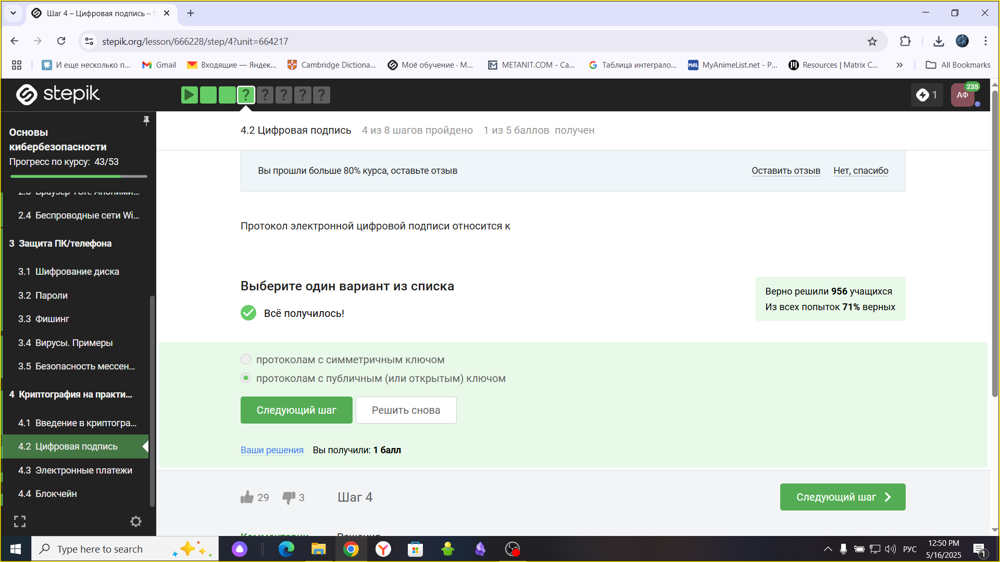
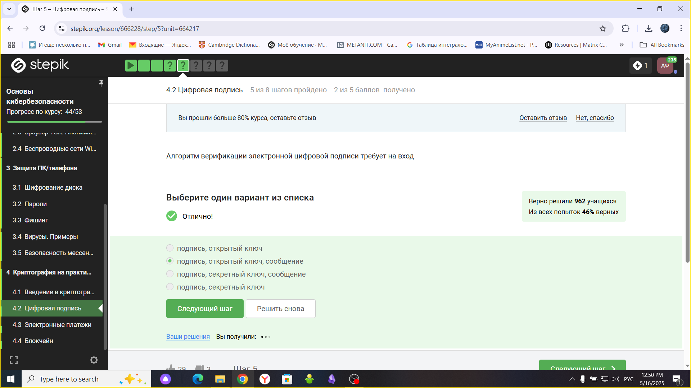
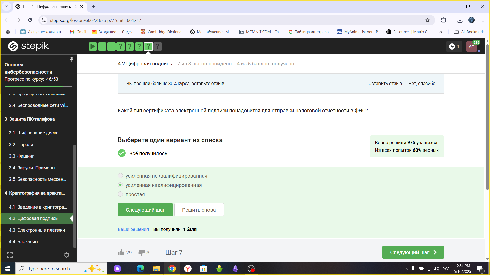
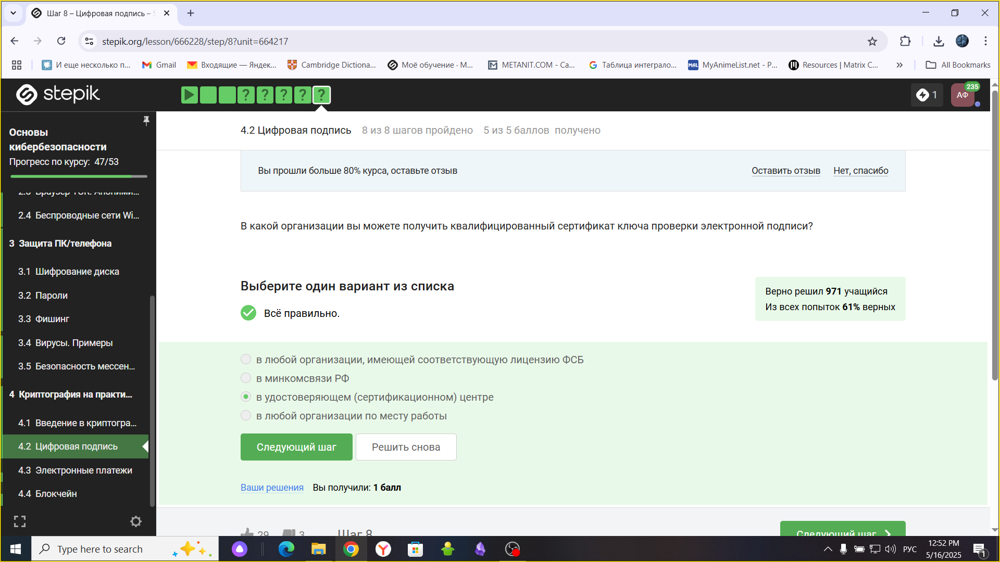
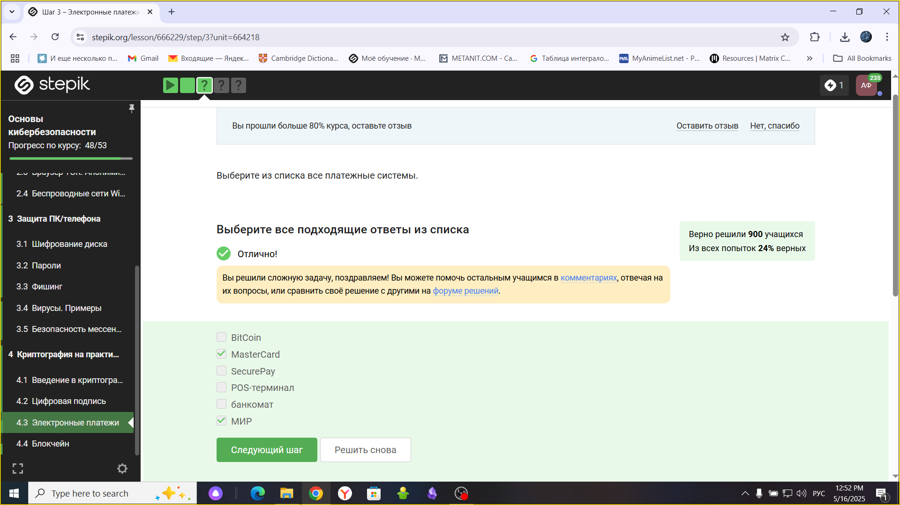
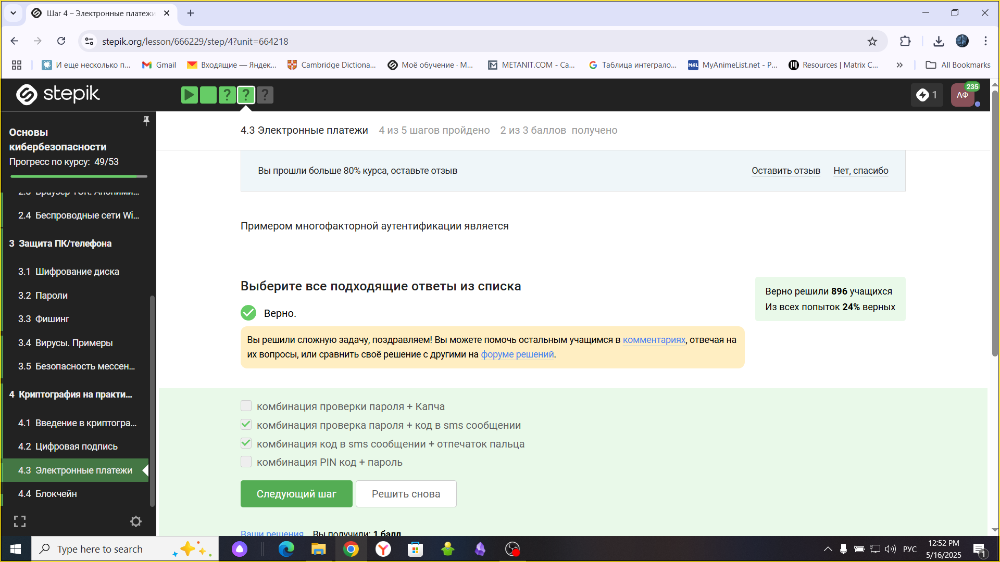
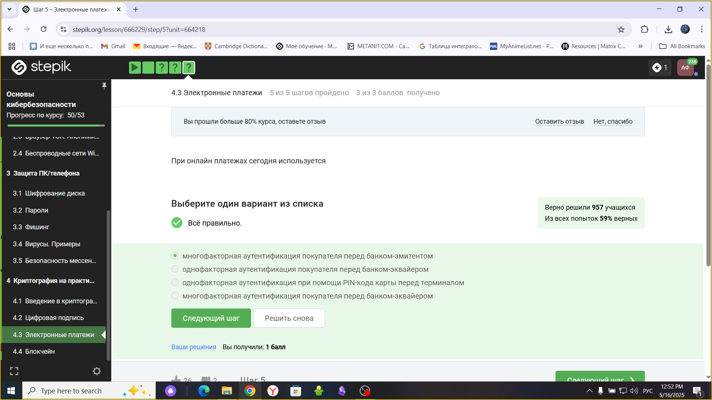
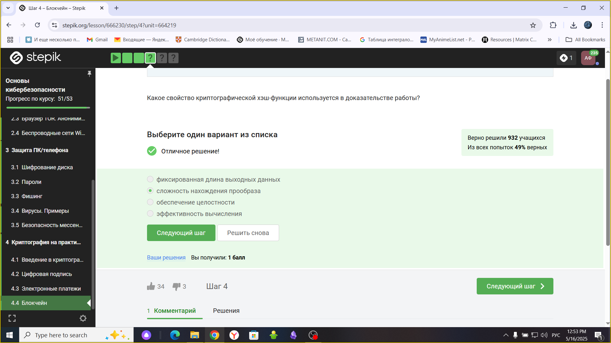
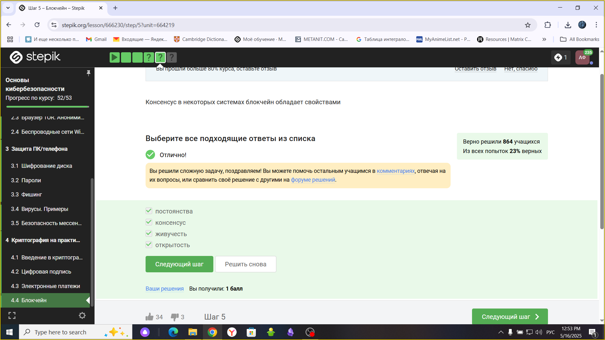
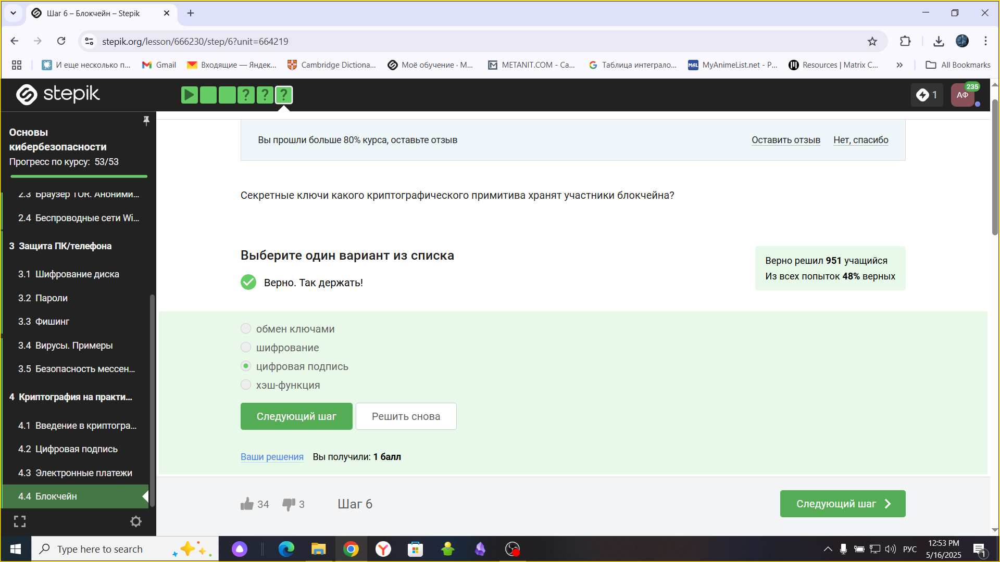

---
## Front matter
title: "Внешний курс. Блок 3: Криптография на практике"
subtitle: "Основы информационной безопасности"

## Generic otions
lang: ru-RU
toc-title: "Содержание"

## Bibliography
bibliography: bib/cite.bib
csl: pandoc/csl/gost-r-7-0-5-2008-numeric.csl

## Pdf output format
toc: true # Table of contents
toc-depth: 2
lof: true # List of figures
lot: true # List of tables
fontsize: 12pt
linestretch: 1.5
papersize: a4
documentclass: scrreprt
## I18n polyglossia
polyglossia-lang:
  name: russian
  options:
	- spelling=modern
	- babelshorthands=true
polyglossia-otherlangs:
  name: english
## I18n babel
babel-lang: russian
babel-otherlangs: english
## Fonts
mainfont: PT Serif
romanfont: PT Serif
sansfont: PT Sans
monofont: PT Mono
mainfontoptions: Ligatures=TeX
romanfontoptions: Ligatures=TeX
sansfontoptions: Ligatures=TeX,Scale=MatchLowercase
monofontoptions: Scale=MatchLowercase,Scale=0.9
## Biblatex
biblatex: true
biblio-style: "gost-numeric"
biblatexoptions:
  - parentracker=true
  - backend=biber
  - hyperref=auto
  - language=auto
  - autolang=other*
  - citestyle=gost-numeric
## Pandoc-crossref LaTeX customization
figureTitle: "Рис."
tableTitle: "Таблица"
listingTitle: "Листинг"
lofTitle: "Список иллюстраций"
lotTitle: "Список таблиц"
lolTitle: "Листинги"
## Misc options
indent: true
header-includes:
  - \usepackage{indentfirst}
  - \usepackage{float} # keep figures where there are in the text
  - \floatplacement{figure}{H} # keep figures where there are in the text
---

# Цель работы

Пройти третий блок курса "Основы кибербезопасности"

# Выполнение блока 3: Криптография на практике

## Введение в криптографию
 
Для ответа на вопрос используется определение ассмиетричного шифрования с двумя ключами (рис. ).

{#fig:001 width=70%}

Отмечены основные условия для криптографической хэш-функции (рис. ).

{#fig:002 width=70%}

Отмечены алгоритмы цифровой подписи (рис. ).

{#fig:003 width=70%}

В информационной безопасности аутентификация сообщения или аутентификация источника данных-это свойство, которое гарантирует, что сообщение не было изменено во время передачи (целостность данных) и что принимающая сторона может проверить источник сообщения (рис. )

{#fig:004 width=70%}

Определение обмена ключами Диффи-Хэллмана. (рис.).

{#fig:005 width=70%}

## Цифровая подпись

По определению цифровой подписи протокол ЭЦП относится к протоколам с публичным ключом (рис. ).

{#fig:006 width=70%}

лгоритм верификации электронной подписи состоит в следующем. На первом этапе получатель сообщения строит собственный вариант хэш-функции подписанного документа. На втором этапе происходит расшифровка хэш-функции, содержащейся в сообщении с помощью открытого ключа отправителя. На третьем этапе производится сравнение двух хэш- функций. Их совпадение гарантирует одновременно подлинность содержимого документа и его авторства (рис. ).

{#fig:007 width=70%}

Электронная подпись обеспечивает все указанное, кроме конфиденциальности (рис. ).

{#fig:008 width=70%}

Для отправки налоговой отчетности в ФНС используется усиленная квалифицированная электронная подпись (рис. ).

{#fig:009 width=70%}

Верный ответ укзаан на изображении (рис. ).

{#fig:010 width=70%}

## Электронные платежи

Известные платежные системы - Visa, MasterCard, МИР (рис.).

{#fig:011 width=70%}

Верный ответ на изображении (рис. ).

# Выводы

Я прошла третий блок
