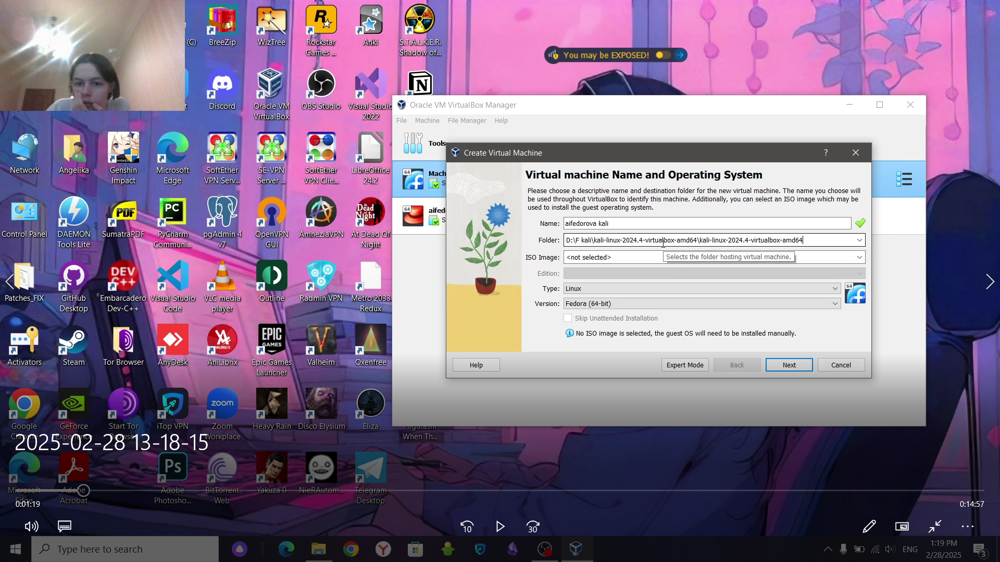
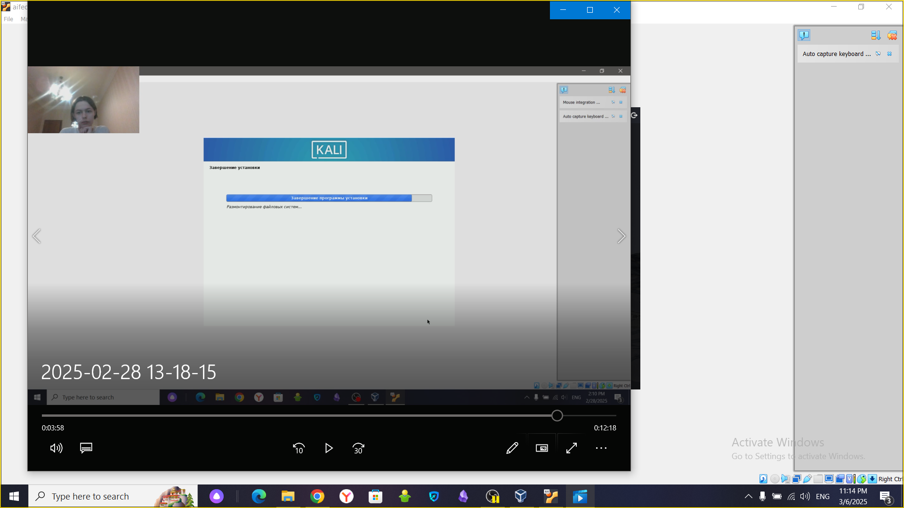
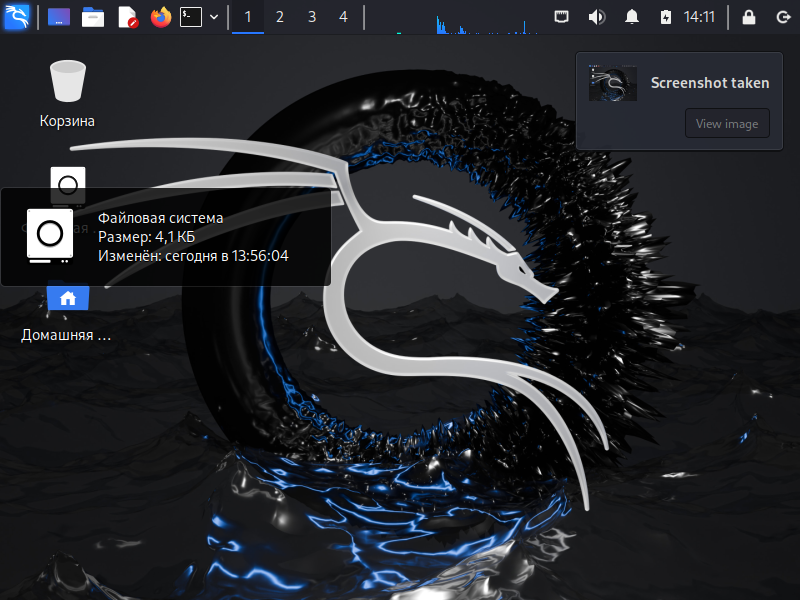

---
## Front matter
lang: ru-RU
title: Презентация по 1-ому этапу индивидуального проекта
subtitle: Основы информационной безопасности
author:
  - Федорова А.И

## i18n babel
babel-lang: russian
babel-otherlangs: english

## Formatting pdf
toc: false
toc-title: Содержание
slide_level: 2
aspectratio: 169
section-titles: true
theme: metropolis
header-includes:
 - \metroset{progressbar=frametitle,sectionpage=progressbar,numbering=fraction}
 
## Fonts
mainfont: PT Serif
romanfont: PT Serif
sansfont: PT Sans
monofont: PT Mono
mainfontoptions: Ligatures=TeX
romanfontoptions: Ligatures=TeX
sansfontoptions: Ligatures=TeX,Scale=MatchLowercase
monofontoptions: Scale=MatchLowercase,Scale=0.9
 
---

## Актуальность

Для проекта важно установить операционную систему Kali

## Цели и задачи

## Выделение места на диске

Ввожу данные о новой виртуальной машины и запускаю установку.(рис.fig:001).

{#fig:001 width=70%}

## Выделение места на диске

Выделяю оперативную память (рис.fig:002).

{#fig:002 width=70%}

## Выделение места на диске

Выделяю память на диске (рис.fig:003)

{#fig:003 width=70%}

## Загрузка операционной системы

Ввожу данные имя пользователя (рис.fig:003)

{#fig:004 width=70%}

## Загрузка операционной системы

Ввожу пароль (рис.fig:003)

{#fig:005 width=70%}

## Загрузка операционной системы

Ввожу часовой пояс  (рис.fig:003)

{#fig:006 width=70%}

## Загрузка операционной системы

Ввожу диск, на который будет устанавливаться система (рис.fig:00)

{#fig:007 width=70%}

## Загрузка операционной системы

Жду установку (рис.fig:003)

{#fig:008 width=70%}

## Загрузка операционной системы

В итоге система успешно установилась (рис.fig:003)

{#fig:009 width=70%}

## Результаты

Я установила новую операционную систему Kali для дальнейшей работы с индивидуальным проектом

## Итоговый слайд

Спасибо за внимание!

