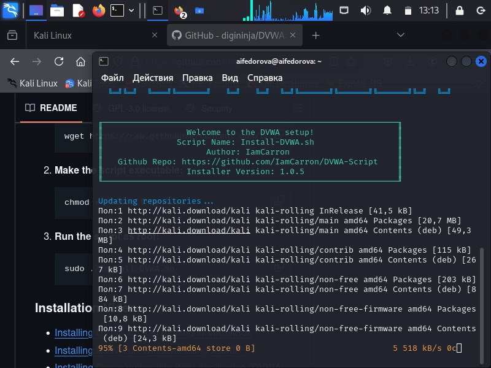
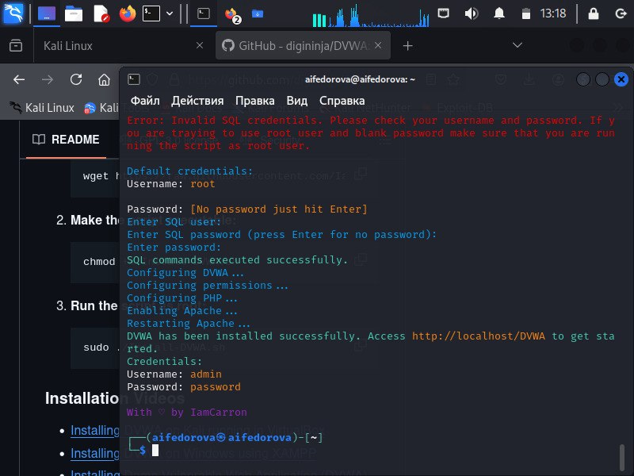
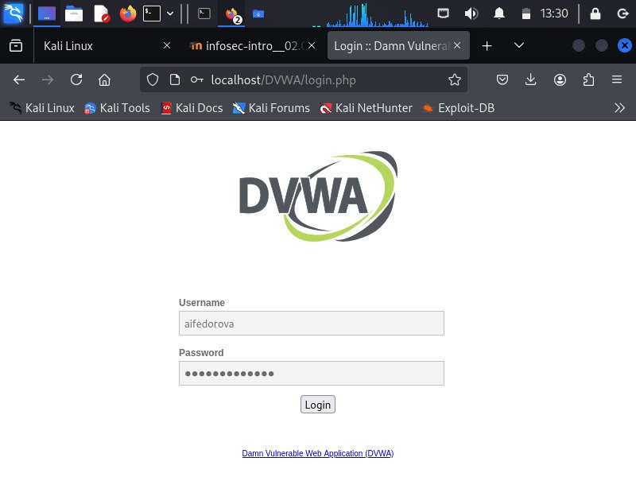
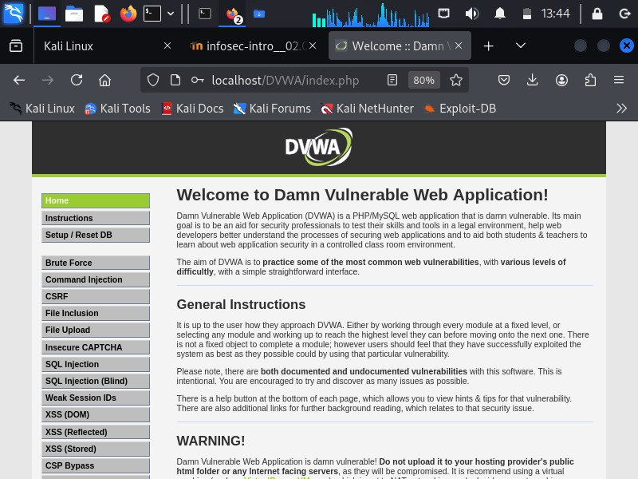

---
## Front matter
lang: ru-RU
title: Презентация по второму этапу инд.проекта
subtitle: Основы информационной безопасности
author:
  - Федорова А.И
  
## i18n babel
babel-lang: russian
babel-otherlangs: english

## Formatting pdf
toc: false
toc-title: Содержание
slide_level: 2
aspectratio: 169
section-titles: true
theme: metropolis
header-includes:
 - \metroset{progressbar=frametitle,sectionpage=progressbar,numbering=fraction}
---

## Актуальность

Для индивидуального проекта потребуется дополнительная система в дополнение к имеющемуся дистрибутиву

## Цели и задачи

Установите DVWA в гостевую систему к Kali Linux.

## Скачивание из репозитория

Захожу в репозиторий по ссылке, скачиваю систему и запускаю ее

{#fig:001 width=70%}

## Скачивание из репозитория

Жду загрузки, ввожу пароль и логин от аккаунта 

{#fig:002 width=70%}

## Ввод данных

Перехожу по ссылке в терминале и ввожу логин и пароль, который был написан в терминале.

{#fig:003 width=70%}

## Ввод данных

Вхожу на сайт 

{#fig:004 width=70%}

## Cоздание датабазы

Создаю датабазу, нажав на кнопку ниже 

{#fig:005 width=70%}

## Вход в систему

Далее меня перенаправляют на страницу входа и я снова захожу в систему, и открываю сайт. 

{#fig:006 width=70%}

## Результаты

Я установила DVWA в качестве гостевой системы к Kali Linux.

## Итоговый слайд

Спасибо за внимание!

