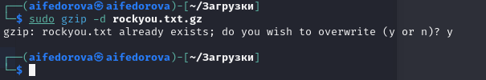
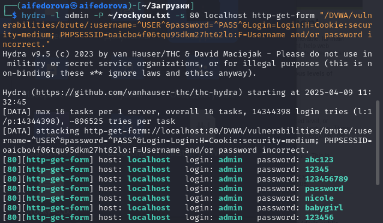
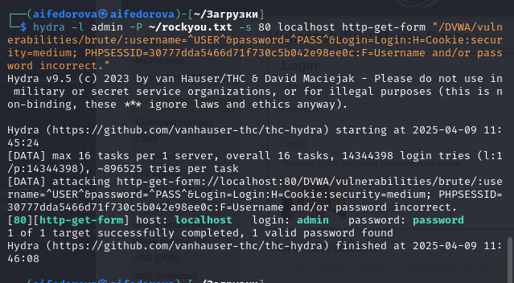
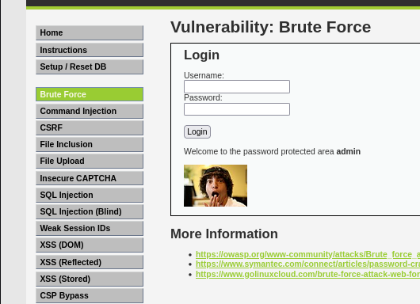

---
## Front matter
lang: ru-RU
title: Презентация по 3-ему этапу инд.проекта
subtitle: Основы информационной безопасности
author:
  - Федорова А.И

## i18n babel
babel-lang: russian
babel-otherlangs: english

## Formatting pdf
toc: false
toc-title: Содержание
slide_level: 2
aspectratio: 169
section-titles: true
theme: metropolis
header-includes:
 - \metroset{progressbar=frametitle,sectionpage=progressbar,numbering=fraction}
 
## Fonts
mainfont: PT Serif
romanfont: PT Serif
sansfont: PT Sans
monofont: PT Mono
mainfontoptions: Ligatures=TeX
romanfontoptions: Ligatures=TeX
sansfontoptions: Ligatures=TeX,Scale=MatchLowercase
monofontoptions: Scale=MatchLowercase,Scale=0.9
---

## Актуальность

Очень важно уметь  подбирать надежные пароли и желательно иметь  специальные программы для этого.

## Цели и задачи

Установить надежный шифрователь паролей

## Материалы и методы

- Представляйте данные качественно
- Количественно, только если крайне необходимо
- Излишние детали не нужны

## Установка 

Скачивачиваю нужный файл. (рис. 1).

{#fig:001 width=70%}

## Установка 

Ввожу необходимые ссылки через Hydra. 

{#fig:002 width=70%}

## Подбор нужного пароля

С помощью расширения получаю куки-файл и получаю подходящий логин и пароль

{#fig:003 width=70%}

## Подбор нужного пароля

Захожу на сайт DWNA и пробую предложенный вариант. Результат положительный.

{#fig:004 width=70%}

## Результаты

Приобрела практические навыки по использованию инструмента Hydra для брутфорса паролей.

## Итоговый слайд

Спасибо за внимание!

