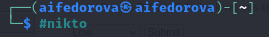
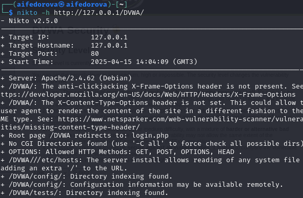
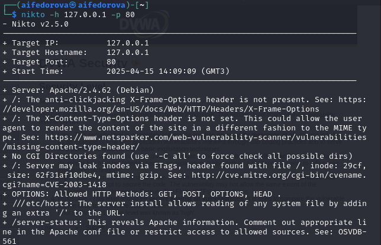

---
## Front matter
lang: ru-RU
title: Презентация по 4-ому этапу индивидуального проекта
subtitle: Основы информационной безопасности
author:
  - Федорова А.И

## i18n babel
babel-lang: russian
babel-otherlangs: english

## Formatting pdf
toc: false
toc-title: Содержание
slide_level: 2
aspectratio: 169
section-titles: true
theme: metropolis
header-includes:
 - \metroset{progressbar=frametitle,sectionpage=progressbar,numbering=fraction}
---

# Цель работы

Научиться тестировать веб-приложения с помощью сканера nikto

# Задание

Использовать nikto

# Выполнение лабораторной работы

Чтобы работать с nikto, необходимо подготовить веб-приложения, которое будем сканировать.

{#fig:001 width=70%}

Ввожу в адресной строке браузера адрес DVWA, перехожу в режим выбора уровня безопасности, ставлю минимальный (необязательно, nikto при обычном сканировании для режима impossible и low выдаст одианковые потенциальные уязвимости, что логично, ведь они остаются, но изменяется сложность, с которой их можно использовать

{#fig:002 width=70%}

Запускаю nikto 

{#fig:003 width=70%}

Проверить веб-приложение можно, введя его полный URL и не вводя порт, попробовала просканировать так.

{#fig:004 width=70%}

Затем попробовала просканировать введя адрес хоста и адрес порта, результаты незначительно отличаются.

{#fig:004 width=70%}

# Выводы

Научилась использовать сканер nikto для тестирования веб-приложений

## Итоговый слайд

Спасибо за внимание!

